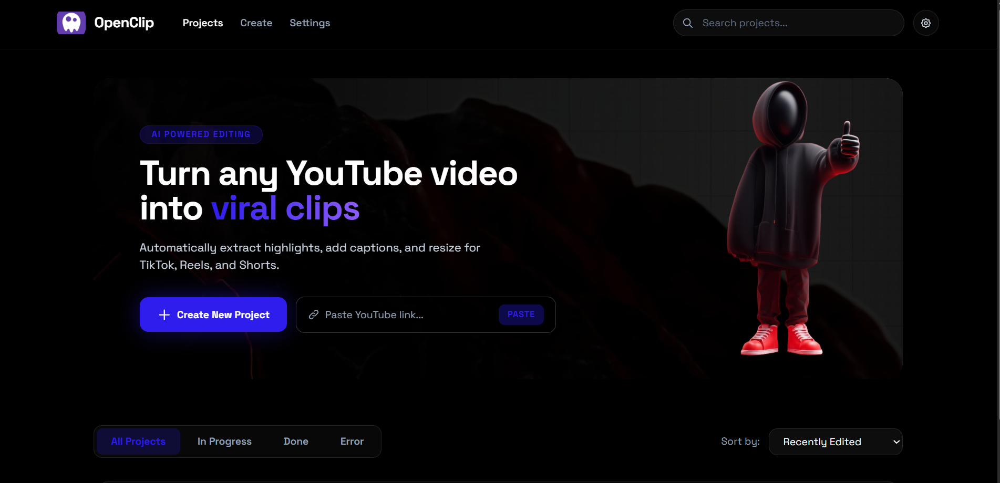

[](https://www.youtube.com/watch?v=2z7CT3J_25M)

# OpenClip by AIONIX



> Open-source, local-first video clipping engine.
> Paste a YouTube URL → download → auto-clip → export.

[](https://github.com/aionixos/openclip)
[](LICENSE)
[](https://github.com/aionixos/openclip)
[](https://github.com/aionixos)

---

## � About the Creator

Hey — I'm **AIONIX**, a builder who is obsessed with AI and machine learning.

I'm on a mission to prove that powerful tools shouldn't cost money. OpenClip is my first major open-source project — built not by a team, not by a funded startup, but by a teenager with a laptop, a vision, and a lot of caffeine.

> **This project is just getting started.** The roadmap is ambitious and the best features are still being built. If you believe in open-source AI tooling, now is the time to get involved — star the repo, fork it, or just stick around. 🚀

---

## ⭐ Support the Project

If OpenClip saves you time (or money on paid tools), ple�ase consider leaving a **star** on GitHub — it genuinely helps more people discover this project and motivates continued development.

**[⭐ Star this repo](https://github.com/aionix/openclip)** — it takes 2 seconds and means a lot.

---

## What is OpenClip?

OpenClip is a **free, open-source, local-first** alternative to paid video clipping tools like OpusClip, Vidyo.ai, and Munch.

- No subscriptions. No water subscriptions. No watermarks. No cloud uploads.
- Everything runs **on your machine**.
- Powered by AI for smart clip detection.

---

## Tech Stack

| Layer            | Tool                           |
|------------------|--------------------------------|
| YouTube Download | yt-dlp + pytubefix (Fallback)  |
| Video Cutting    | FFmpeg (direct CLI subprocess) |
| Layout Detect    | Pillow / numpy                 |
| Face Tracking    | MediaPipe (Tasks API)          |
| Audio Tracking   | FFmpeg (astats RMS energy)     |
| Final Rendering  | FFmpeg (filter_complex)        |
| Backend          | Python (FastAPI)               |
| Frontend         | Next.js (React + TypeScript)   |
| Local Storage    | SQLite                         |

---

## Project Structure

```
openclip/
├── backend/
│   ├── api.py              ← FastAPI routes + WebSocket
│   ├── database.py         ← SQLite schema & CRUD
│   ├── downloader.py       ← yt-dlp integration
│   ├── clipper.py          ← FFmpeg clip generation
│   ├── reframer.py         ← 9:16 reframing via FFmpeg
│   ├── layout_detector.py  ← Smart screen & face layout detector
│   ├── speaker_detector.py ← Active speaker detection (Audio + Lips)
│   ├── transcriber.py      ← Caption generation (VTT/Whisper)
│   ├── llm.py              ← AI clip suggestions
│   └── requirements.txt
├── frontend/
│   ├── app/
│   │   ├── page.tsx                ← Dashboard
│   │   ├── create/page.tsx         ← Create New
│   │   └── project/[id]/page.tsx   ← View Project
│   ├── components/
│   │   ├── ProjectCard.tsx
│   │   ├── ProgressBar.tsx
│   │   ├── ClipCard.tsx
│   │   └── VideoPlayer.tsx
│   ├── lib/
│   │   └── api.ts          ← Typed API client
│   └── package.json
├── data/
│   └── openclip.db         ←  ← SQLite database (auto-created)
├── tmp/                    ← Downloaded/processed videos
└── README.md
```

---

## Quick Start

### One-Line Install

```bash
git clone https://github.com/aionixos/openclip.git && cd openclip && bash setup.sh
```

Or if you've already cloned the repo:

```bash
bash setup.sh
```

Then start the app:

```bash
bash start.sh
```

This will start:
- **Frontend:** http://localhost:3000
- **Backend:** http://localhost:8000
- **API Docs:** http://localhost:8000/docs

### Prerequisites

- **Python 3.11+**
- **Node.js 18+**
- **FFmpeg** installed and on PATH

> The setup script will check all dependencies and install yt-dlp automatically if needed.

---

## API Endpoints

| Method | Path                            | Description                     |
|--------|---------------------------------|---------------------------------|
| GET    | `/api/projects`                 | List all projects               |
| POST   | `/api/projects`                 | Create new project + auto-start |
| GET    | `/api/projects/{id}`            | Get project details & clips     |
| DELETE | `/api/projects/{id}`            | Delete project & files          |
| POST   | `/api/clips/{id}/layout`        | Reprocess a clip's layout       |
| WS     | `/ws/progress/{id}`             | Real-time progress updates      |

---

## MVP Scope

✅ Paste YouTube URL → download via yt-dlp
✅ Extract captions (Manual → Auto → Whisper)
✅ AI-driven viral hook detection (LLM)
✅ Smart layout detection (Tutorial, Podcast, Panel, Single, None)
✅ Active speaker tracking via FFmpeg audio RMS
✅ Auto-cut and face-track into 9:16 clips (FFmpeg filter_complex + MediaPipe)
✅ Save project + rich clip metadata to SQLite
✅ Display clips in View Project screen
✅ Show history on Dashboard
✅ Real-time progress via WebSocket / HTTP Polling

---

## 🚀 Recent Updates

- **Browser-Side API Keys:** Your LLM API keys are now stored securely in your browser's `localStorage`. They never touch the backend database, making this safe to host publicly.
- **YouTube Bot Bypass:** Added `pytubefix` as an automated fallback to bypass YouTube's aggressive "Sign in to prove you're not a bot" datacenter blocks (PO Token support enabled).
- **Vercel Compatibility:** The real-time progress tracker now seamlessly falls back to fast HTTP Polling if Vercel's Edge network blocks the WebSocket connection.

---

## Roadmap

> OpenClip is actively being built. Here's what's coming next:

- [ ] Phase 3: Scene & silence-based auto clip detection
- [ ] Batch processing for multiple URLs
- [ ] Export presets (TikTok, Reels, Shorts)
- [ ] Custom branding / watermark overlay
- [ ] GUI installer for non-technical users

---

## Contributing

OpenClip is open to contributors of all levels. If you find a bug, have a feature idea, or want to help build the roadmap — open an issue or a PR. All contributions are welcome.

---

## Frequently Asked Questions

**Q1. Do I need to pay for anything?**
```
No. OpenClip is 100% free and local.
You only need an API key from your chosen LLM provider.
All providers have free tiers:
  Gemini 1.5 Flash → 1,500 requests/day free
  Ollama           → completely free, runs locally
  OpenAI/Anthropic → paid but cheap (~$0.01 per video)
FFmpeg, yt-dlp, Python, Node — all free.
```

---

**Q2. Where is my data stored?**
```
Everything stays under your control.
  Videos    → /tmp folder on your machine
  Database  → /data/openclip.db (SQLite file)
  Settings  → API Keys are stored strictly in your browser's LocalStorage!
  Clips     → /tmp/{project_id}/clips/

The only external calls are:
  yt-dlp   → YouTube (to download)
  LLM API  → your chosen provider (transcript only)
```

---

**Q3. How do I add my API key?**
```
1. Open OpenClip in browser (http://localhost:3000)
2. Click Settings (gear icon, top right)
3. Choose your LLM provider from dropdown
4. Paste your API key
5. Click Save

Your key is stored purely in your browser's `localStorage` cache.
It is completely isolated to your device and never hits the server database!
```

---

**Q4. FFmpeg is not working / not found**
```
FFmpeg must be installed separately. Steps:

Windows:
  1. Download from https://ffmpeg.org/download.html
  2. Extract zip
  3. Add bin/ folder to System PATH
  4. Restart terminal
  5. Test: ffmpeg -version

Mac:
  brew install ffmpeg

Linux:
  sudo apt install ffmpeg

Then restart OpenClip backend.
```

---

**Q5. Can I contribute if I only know frontend / only know Python?**
```
Yes. The project is split cleanly:

Frontend only (Next.js/TypeScript):
  Look for issues labeled "frontend"
  You never need to touch Python

Backend only (Python/FastAPI):
  Look for issues labeled "backend"
  You never need to touch React

Docs only:
  Look for issues labeled "documentation"
  Just markdown, no code needed

Design only:
  Look for issues labeled "design"
  Figma or CSS improvements welcome
```

---

**Q6. My video failed to process, what do I do?**
```
Check in this order:

1. Is FFmpeg installed?
   Run: ffmpeg -version

2. Is the video public?
   Private/age-restricted videos cannot be downloaded.

3. Did the LLM fail?
   Check your API key in Settings.
   Check your provider's quota/limits.

4. Check terminal logs:
   Backend terminal shows exact error.
   Copy the error and open a GitHub Issue.

5. Try a shorter video first (under 10 minutes)
   to verify your setup works.
```
---

**Q7. How do I suggest a feature or report a bug?**
```
Feature idea:
  Go to GitHub → Discussions → Ideas
  Describe what you want and why.
  Upvote existing ideas you agree with.

Bug report:
  Go to GitHub → Issues → New Issue
  Choose "Bug Report" template
  Fill in all fields including your terminal error.

Want to build something yourself:
  Comment on the issue "I'll work on this"
  Fork the repo, build it, open a Pull Request.
  We review and merge if it's good.
```

---

## License

MIT License — see [LICENSE](LICENSE) for details.

---

<p align="center">
  Built with � by <strong>AIONIX</strong>.
</p>
�